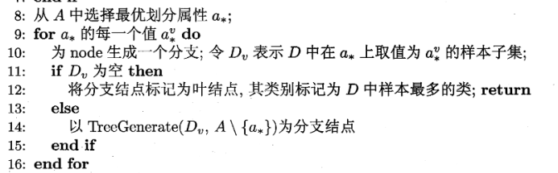

# 人工智能基础-实验2报告

***

梁峻滔 PB19051175

***

[toc]

## 2.1 决策树

### 决策树生成算法

采用实验文档提供的参考算法, 即


### 选择最优划分属性

这里根据信息增益来选择最优划分属性: 先针对全局样本计算每个属性的信息增益, 后面每次选择划分属性时都是从剩余属性集中选择信息增益最大的属性.

#### (a) 计算信息增益

```python
# DecisionTree.py
def cal_info_gain(self, train_features, train_labels):...
```

 根据训练集: train_features和train_labels计算每个属性的信息增益, 返回一个列表info_gains, 其中 info_gains[i] 就是第 i 个属性(i = 0, 1, ..., 8)的信息增益.

信息增益计算的具体实现略, 源码里注释说明得很清楚了.

#### (b) 选择信息增益最大的属性

```python
# Decisionree.py
def choose_attr(self, attrs, info_gains):...
```

参数说明:

* attrs: 剩余的属性(编号)集
* info_gains: 前面计算出来的各个属性的信息增益

 该方法从attrs中根据info_gains挑出信息增益值最大的属性, 返回该属性的编号.

### 生成树节点

树节点结构:

```python
class treenode:
    def __init__(self, attr=None, category=None):
        self.attr = attr         
        self.category = category 
        self.children = {}       
   
    def set_attr(self, attr):
    def set_category(self, category):
    def get_attr(self):
    def get_category(self):
    def append_child(self, val, child):
    def get_child(self, val):
    def get_branches(self):
```

属性说明:

* attr: 该树节点的分支属性, 对于非叶节点, 搜索该节点根据attr的取值来选择下一个分支.
* category: 类别, 对于叶节点, 该属性值为1/0, 表示最终分类; 对于非叶节点, 该属性值为2(其实并不需要).
* children: 孩子节点, 是一个字典, 以attr的各个取值作为索引, 字典值就是各个孩子节点.

#### (a) 生成叶节点:

该部分对应参考算法中的这一段:


实现为:

```python
# DecisionTree.py
def generate_tree(self, root, samples, attrs, values_attrs,...):
    category = self.get_category(samples, train_labels)
        if category == 1 or category == 0:
            # 如果samples中所有样本全属于同一类别C, 将节点标记为C类节点
            root.category = category
        		return
        elif len(attrs) == 0 or self.same_on_attrs(samples, train_features, attrs):
            # 如果剩余属性集attrs为空
            # 或者samples中样本在attrs上取值相同(意味着属性集取值相同却存在不同类别)
            # 将节点类别标记为samples中样本数最多的类别
            root.category = self.get_most_category(samples, train_labels)
            return
    ...
```

root是外层调用方已经实例化的一个树节点.

相关方法说明:

* get_category(samples): 树节点类方法, 输入样本集, 判断该样本集的分类, 如果样本集中所有样本的label都是1, 则返回1; 如果样本集中所有样本的label都是0, 则返回0; 否则返回2(表示样本集中存在不同类别的样本).
* same_on_attrs(samples, attrs): 判断所给样本集samples在所给属性值attrs上是否取值都相同.
* get_most_category(samples): 返回样本集samples中样本数最多的类别.


#### (b) 生成非叶节点

该部分对应算法中这一段:



所做的工作就是从剩余属性集中选择一个最优的划分属性, 然后为每个属性取值创建一个分支, 在每个分支里递归生成子树.

实现为:

```python
# DecisionTree.py
def generate_tree(self, root, samples, attrs, values_attrs,...):
    ...
    best_attr = self.choose_attr(attrs, info_gains) # 选择最优属性
    root.set_attr(best_attr)
    root.set_category(2) 		# 设置为非叶节点
    values = values_attrs[best_attr] # 最优属性的取值范围
    for value in values:
        subsamples = self.get_subsamples(best_attr, value, samples, train_features)
        if len(subsamples) == 0:
            # 没有在best_attr上该取值的样本
            # 将分支节点标记为叶节点, 其类别标记为samples中样本最多的类
            child = treenode()
            child.set_category(self.get_most_category(samples, train_labels))
            root.append_child(value, child)
        else:
            # 以generate_tree(Dv, A\{a*})为分支节点
            subattrs = copy.deepcopy(attrs)
            subattrs.remove(best_attr)
            child = treenode()
            self.generate_tree(child, subsamples, subattrs, values_attrs, train_features, train_labels, info_gains)
            root.append_child(value, child)
```

相关说明:

* subsamples在attr上的取值范围只是samples在attr上取值范围的一个子集！！values必须使用全局的属性取值范围.

### 测试结果


## 2.2 支持向量机

实验要求: 实现软间隔SVM训练算法

具体任务: 求解如下二次规划问题


### 模型训练/二次规划问题求解

变量和相关参数说明:

* α: 整个二次规划问题中的变量, 需要优化的参数, 是一个向量, 一个分量对应一个样本.
* y: 训练集样本的label向量.
* K: 核函数矩阵, $K_{ij}$即$K(x_i, x_j)$.
* C: 软间隔参数

模型训练过程包括以下步骤:

1. 计算$yy^T$和$K$, $K$的计算需要调用助教提供的KERNEL函数.
2. 使用 cvxpy 建立目标函数和约束, 然后求解
3. 求解后记录 α 的值, 以及根据 α 的取值记录支持向量, 一遍后面测试时对测试样本进行分类.

实现为(注释中大致注明是对应哪个步骤):

```python
def fit(self, train_data, train_label):
    '''
    实现软间隔SVM训练算法
    train_data：训练数据，是(N, 7)的numpy二维数组，每一行为一个样本
    train_label：训练数据标签，是(N,)的numpy数组，和train_data按行对应
    '''
    n = train_data.shape[0]
    alpha = cvx.Variable(n, pos=True)
    # stage1
    yyT = self.cal_yyT(train_label)
    K = self.cal_K(train_data)
    # stage2
    G = yyT * K # 星乘, 矩阵内各位置的元素相乘
    obj = cvx.Maximize(cvx.sum(alpha) - (1/2)*cvx.quad_form(alpha, G))
    constraints = [alpha <= self.C,
                    cvx.sum(cvx.multiply(alpha, train_label)) == 0]
    prob = cvx.Problem(obj, constraints)
    prob.solve(adaptive_rho=False)
    # stage3
    self.debur(alpha.value)
    for i in range(len(alpha.value)):
        if alpha.value[i] > 0:
            self.SV_alpha.append(alpha.value[i])
            self.SV.append(train_data[i])
            self.SV_label.append(train_label[i])
```

### 测试

#### 预测分类

对单个样本的预测分类:


注意到只有支持向量的$α_j$才不为0, 因此仅使用已求出的支持向量就可以进行预测分类.

实现为:

```python
def predict_single(self, x):
    predict_y = 0.0
    for j in range(len(self.SV)):
        alpha_j = self.SV_alpha[j]
        yj = self.SV_label[j]
        xj = self.SV[j]
        predict_y += alpha_j * yj * self.KERNEL(xj, x)
    predict_y += self.b
    if predict_y >= 0:
        return 1
    else:
        return -1
```

对每个测试样本都调用一次上述过程即可.

#### 测试结果


## 2.3 感知机模型

实验要求:

* 通过矩阵运算实现模型
* 实现各参数的梯度计算, 给出各参数矩阵的梯度, 并与pytorch自动计算的梯度进行对比
* 实现梯度下降算法优化参数矩阵, 给出loss的训练曲线

### 感知机模型及其实现

感知机模型:


前向传播相关:


激活函数:


实现时的模型参数为:

```python
# MLP_manual.py
class MLP:
    def __init__(self):
        # layer size = [10, 8, 8, 4]
        # 初始化所需参数   
        self.x_size = 10
        self.h1_size = 10
        self.h2_size = 8
        self.h3_size = 8
        self.y_size = 4
        self.W1 = np.random.rand(self.h1_size, self.x_size)
        self.W2 = np.random.rand(self.h2_size, self.h1_size)
        self.W3 = np.random.rand(self.h3_size, self.h2_size)
        self.W4 = np.random.rand(self.y_size, self.h3_size)
        self.b1 = np.random.rand(self.h1_size)
        self.b2 = np.random.rand(self.h2_size)
        self.b3 = np.random.rand(self.h3_size)
        self.b4 = np.random.rand(self.y_size)
        self.s1 = tanh_vec
        self.s2 = tanh_vec
        self.s3 = tanh_vec
        self.s4 = softmax
```

Wi和bi就是对应模型中的各个隐层参数, si就是各个激活函数.

前向传播实现:

```python
def forward(self, x):
    # 前向传播
    # x是 一个 样本
    forward_pack = {}
    h1 = np.zeros(self.h1_size)
    h2 = np.zeros(self.h2_size)
    h3 = np.zeros(self.h3_size)
    y_predict = np.zeros(self.y_size)

    h1 = self.s1(np.dot(self.W1, x) + self.b1)
    h2 = self.s2(np.dot(self.W2, h1) + self.b2)
    h3 = self.s3(np.dot(self.W3, h2) + self.b3)
    y_predict = self.s4(np.dot(self.W4, h3) + self.b4)

    forward_pack['h1'] = h1
    forward_pack['h2'] = h2
    forward_pack['h3'] = h3
    forward_pack['y_predict'] = y_predict
    return forward_pack
```

前向传播所做的工作就是从传入的样本$x$开始, 使用$h_i = s_i(\textbf{W}_ih_{i-1}+\textbf{b}i)$逐层计算$h_i$, 直到计算出输出层(即y_predict), 返回各层的计算结果给反向传播使用.

### Wi和bi的梯度计算

对每个样本进行一次前向传播计算出 $\hat{y}$ 后紧接着就进行反向传播计算各参数的梯度.

#### (a) 自己使用求导公式计算

相关求导公式:


这部分的难点主要在于求导公式的理解. 下一给出逐层反向计算过程:

* 首先是$s_i'(i = 1, 2, 3)$, 注意到$s_1 = s_2 = s_3 = tanh(.)$, $s_1' = s_2' = s_3' = 1-tanh^2$, 所以实际计算过程就是$s_i' = 1-s_i$, $s_i$是一个向量/数组, 对各个分量计算即可, 得到的$s_i'$也是一个向量/数组.

* h3-y: 即最后一层隐层到输出层

    * $\frac{\partial L}{\partial \textbf{b}_4} = l's_4'$: 注意到
        $$
        \begin{equation}
        (l's_4')=
        \begin{cases}
        \hat{y_i}-1& {i=t}\\
        \hat{y_i}& {i \neq t}
        \end{cases}
        \end{equation}
        $$
        根据样本的实际类别的one-hot向量计算出t, 然后使用前向传播计算得到的$\hat{y}$按分量计算即可, 结果是一个4×1向量.

    * $\frac{\partial L}{\partial \textbf{W}_4} = (l's_4')\textbf{h}_3^T$: 利用前面的计算结果, 可得$\frac{\partial L}{\partial \textbf{W}_4} = (\frac{\partial L}{\partial \textbf{b}_4})\textbf{h}_3^T$, $\textbf{h}_3^T$是一个1×8向量, 因此计算结果是一个4×8矩阵.

* h2-h3:

    * $\frac{\partial L}{\partial \textbf{b}_3} = \textbf{W}_4^T(l's_4')⊙s_3'$: $\textbf{W}_4^T$是一个8×4矩阵,; $(l's_4')$是一个4×1向量; ⊙是按分量乘; $s_3'$前面讨论过, 是一个8×1的向量. 计算结果是一个8×1向量.
    * $\frac{\partial L}{\partial \textbf{W}_3} = (\textbf{W}_4^T(l's_4')⊙s_3')\textbf{h}_2^T = (\frac{\partial L}{\partial \textbf{b}_3})\textbf{h}_2^T$: $\frac{\partial L}{\partial \textbf{b}_3}$是一个8×1向量, $\textbf{h}_2^T$是一个1×8向量, 计算结果是一个8×8矩阵.

* 依此类推, 每次计算都需要利用前面计算的结果.

实现为:

```python
def backward(self, x, forward_pack, label, lr): # 自行确定参数表
    # 反向传播
    '''
    输入: 一个样本的输出预测值y_predict和实际label, 以及学习率lr
    计算Wi和bi的梯度, 然后做一次梯度下降调整参数
    '''
    t = np.argmax(label)
    h1 = forward_pack['h1']
    h2 = forward_pack['h2']
    h3 = forward_pack['h3']
    y_predict = forward_pack['y_predict']
    loss = -math.log(y_predict[t])
    # print('    loss: %f'%loss)
    
    # 计算梯度
    gs1 = np.zeros(h1.shape)
    gs2 = np.zeros(h2.shape)
    gs3 = np.zeros(h3.shape)
    for i in range(len(gs1)):
        gs1[i] = 1 - h1[i] ** 2
    for i in range(len(gs2)):
        gs2[i] = 1 - h2[i] ** 2
    for i in range(len(gs3)):
        gs3[i] = 1 - h3[i] ** 2
    gb4 = np.zeros(label.shape) # gb4 stands for gradient of b4, equals to l's4'
    for i in range(len(label)):
        if i == t:
            gb4[i] = y_predict[i] - 1
        else:
            gb4[i] = y_predict[i]
    gb4 = gb4.reshape(-1, 1) # 将数组转化成列向量
    gW4 = np.dot(gb4, h3.reshape(1, -1)) # 注意h3转化成行向量
    gb3 = np.dot(self.W4.T, gb4) * gs3.reshape(-1, 1)
    gW3 = np.dot(gb3, h2.reshape(1, -1))
    gb2 = np.dot(self.W3.T, gb3) * gs2.reshape(-1, 1)
    gW2 = np.dot(gb2, h1.reshape(1, -1))
    gb1 = np.dot(self.W2.T, gb2) * gs1.reshape(-1, 1)
    gW1 = np.dot(gb1, x.reshape(1, -1))
    
    # 梯度下降调整Wi和bi
    self.W1 -= lr * gW1
    self.b1 -= lr * gb1.reshape(-1)
    self.W2 -= lr * gW2
    self.b2 -= lr * gb2.reshape(-1)
    self.W3 -= lr * gW3
    self.b3 -= lr * gb3.reshape(-1)
    self.W4 -= lr * gW4
    self.b4 -= lr * gb4.reshape(-1)
```

实现时有一些关于ndarray数组转化成列向量之类的细节需要注意.

#### (b) pytorch自动求导计算

不会. 我全程用的numpy, 后面才发现如果要用pytorch求导, 需要使用torch.tensor. 而且第四题的实现中, torch的求导过程是连各个参数矩阵都封装起来了(各层都是直接使用torch的相关接口: Conv2d, Linear等定义的, 不像本题这样显式定义矩阵). 要么将ndarray全部换成tensor后再研究一遍, 要么用第四题的方式重新定义模型. 无论哪一种都相当于重写一遍, 不行了, 投降www.

### 梯度下降优化参数矩阵

在上面提到的反向传播中的最后一段进行参数的优化, 使用梯度下降调整参数:


其中$η$是学习率. loss的训练曲线:


## 2.4 卷积神经网络

### 模型建立

我的学号是PB19051175, 选用的是(7 + 5) % 6 + 1 = 1号模型:


其他相关参数:

* 图像输入大小: 3 × 32 × 32, # input channels = 3.
* 默认池化大小为2.

各层设置为:

```python
def __init__(self):
		super(MyNet, self).__init__()
    self.conv1 = nn.Conv2d(3, 16, 5)    # layer 1 
    self.pool1 = nn.MaxPool2d(2, 2)     # layer 2
    self.conv2 = nn.Conv2d(16, 32, 5)   # layer 3
    self.pool2 = nn.MaxPool2d(2, 2)     # layer 4
    self.fc1 = nn.Linear(32*5*5, 120)   # layer 6
    self.fc2 = nn.Linear(120, 84)       # layer 7
    self.fc3 = nn.Linear(84, 10)        # layer 8
```

其中下一层的输入channel数等于上一层的输出channel数.

各个channel数的计算过程大致如下:


前向传播: 激活函数使用tanh, 逐层计算.

```python
def forward(self, x):
    ########################################################################
    # 这里需要写MyNet的前向传播
    # model 1激活函数采用tanh
    x = self.pool1(torch.tanh(self.conv1(x)))
    x = self.pool2(torch.tanh(self.conv2(x)))
    x = x.view(-1, 32*5*5)
    x = torch.tanh(self.fc1(x))
    x = torch.tanh(self.fc2(x))
    x = self.fc3(x)
    return x
```

反向传播和优化参数都是直接调用pytorch相关接口.

### 训练运行过程和测试结果


